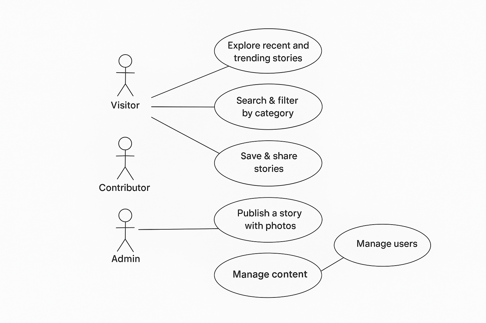

# Blog- Meknes –  Meknes Stories-Inspire-Blog
# Subject:
Meknes – Meknes Stories  
How to tell the human and cultural stories of Meknes through a participatory blog?

___________________________________
## Primary User Identification

### salma – Busy Reader (Priority)
**Age/Context:**  
22 years old, a university student in Meknes. She reads articles on her smartphone between classes or during short breaks. She enjoys discovering stories about her city and learning from other people’s experiences.

**Main Objective:**  
To quickly read recent and interesting stories about Meknes, without spending too much time searching.

**Key Needs:**
- Quickly find popular or trending articles.  
- Save and share articles with friends.  
- Enjoy short, clear, and visual content suitable for mobile reading.  
- Access content easily, even with an average internet connection.

**Frustration:**  
Slow navigation, unclear titles, too much text, and lack of summarized content for short reading times.

**Environment:**  
Smartphone or labtop, average Wi-Fi or 4G connection, short sessions of 5–10 minutes between classes.

___________________________________
### Alex – Tourist Visitor
**Age/Context:**  
29 years old, international traveler visiting Meknes to explore its authentic culture and history. Uses a smartphone for quick searches while traveling and a laptop for planning visits.

**Main Objective:**  
To discover the human and cultural stories of Meknes and find meaningful places to visit based on locals’ experiences.

**Key Needs:**
- Access short and visual articles about local culture and people.  
- Find recommendations for cultural places, events, or hidden gems.  
- Save or share stories and itineraries.  
- Use the platform easily even with a limited mobile connection.

**Frustration:**  
Difficulty finding reliable and engaging information about local culture. Many websites are outdated, text-heavy, or not optimized for mobile.

**Environment:**  
Android smartphone and laptop, limited mobile data while traveling.

___________________________________
## Define the Problem and the Solution

### Problem Statement
For the **busy reader**, who struggles to find short and engaging stories about Meknes,  
we want to create a **mobile-friendly participatory blog** where she can quickly read, save, and share local human and cultural stories,  
so that she can stay connected to her city and its people without wasting time.

For the **tourist visitor**, who lacks access to authentic and well-presented cultural content,  
we want to build a **story-sharing platform** that gathers articles, photos, and local experiences from the community,  
so that they can discover Meknes’ heritage and plan meaningful visits even with a limited connection.

# 5. Main Features and Use Cases

## 5.1 Brainstorm – All Possible Features
- Browse list of human and cultural stories about Meknes  
- View story details (description, location, images, author, date)  
- Save stories to favorites  
- Share stories on social media  
- Comment or leave feedback on stories  
- Receive notifications about new stories or updates  
- Filter stories by category (culture, history, events, people, hidden gems…)  
- Access offline mode for low-connectivity users  
- Access the platform via mobile app (Android)  
- Register as a contributor to publish stories  
- Moderate or manage content (for administrators)  

## 5.2 Prioritized Features (MoSCoW Method)

| Fonctionnalité | Description | Priorité (MoSCoW) |
|----------------|------------|-----------------|
| Lister les articles | Permet à tous les utilisateurs (visiteurs, enregistrés, admin) de voir les articles récents et les histoires publiées | Must |
| Ouvrir un article | Affiche le contenu complet d’un article, avec ses images, auteur, date de publication et localisation si disponible | Must |
| Sauvegarder un article | L’utilisateur enregistré peut ajouter un article à ses favoris pour le consulter plus tard | Should |
| Commenter / Aimer / Partager un article | Permet aux utilisateurs enregistrés d’interagir avec le contenu via commentaires, likes ou partage | Should |
| Publier un article / une mise à jour | Permet aux contributeurs et aux administrateurs de publier de nouveaux articles sur la plateforme | Must |
| Rechercher / Filtrer les articles | Permet aux utilisateurs de rechercher des articles par mot-clé ou par catégorie | Could |
| Gérer les articles publiés | L’administrateur peut modifier, approuver ou supprimer les articles pour modérer le contenu | Should |
| Recevoir notifications | Les utilisateurs reçoivent des notifications pour les nouveaux articles ou réponses aux commentaires | Could |
| Mode hors-ligne | Permet la lecture des articles sauvegardés même sans connexion internet | Could |

## 5.3 Use Cases (UC)

| ID | Acteur | Cas d’utilisation (UC) | Priorité |
|----|--------|-----------------------|----------|
| UC1 | Visiteur / Utilisateur enregistré / Admin | Accueil (Afficher la liste des articles) | Must |
| UC2 | Visiteur / Utilisateur enregistré / Admin | Consulter un article en détail | Must |
| UC3 | Utilisateur enregistré / Admin | Ajouter un article aux favoris | Should |
| UC4 | Utilisateur enregistré / Admin | Commenter / Aimer / Partager un article | Should |
| UC5 | Contributeur / Admin | Publier un article ou une mise à jour | Must |
| UC6 | Utilisateur enregistré / Admin | Rechercher ou filtrer des articles par catégorie | Could |
| UC7 | Admin | Gérer / Modérer le contenu publié | Should |
| UC8 | Utilisateur enregistré | Recevoir des notifications sur les nouveaux articles | Could |
| UC9 | Utilisateur enregistré | Lire les articles sauvegardés hors-ligne | Could |
| UC10 | Contributeur | Soumettre un nouvel article pour approbation | Must |

___________________________________
### Use Case Diagram

# 6. Wireframes / UI Suggestions

**Home Screen:**  
- Latest stories in card layout with title, image, short summary  
- Search bar and category filters  
- Trending or popular stories section  

**Article Detail Page:**  
- Full content with images, author, date, and location  
- Buttons: Save, Share, Comment, Like  
- Related stories suggestions  

**Profile / Favorites Page:**  
- Saved stories  
- User comments and contributions  

**Admin / Contributor Dashboard:**  
- Publish new stories  
- Approve or edit submissions  
- Track views, likes, and shares  

___________________________________

# 7. Technical Considerations

- **Platform:** Mobile-first web, Android app  
- **Backend:** CMS for managing articles and user contributions  
- **Database:** Store articles, users, comments, categories, and favorites  
- **Offline Mode:** Cache saved stories for low connectivity  
- **Notifications:** Push notifications for new articles or comments  
- **Performance:** Optimize images and content for low bandwidth  

___________________________________

# 8. Conclusion

The Meknes Stories participatory blog allows both locals and visitors to explore the human and cultural heritage of Meknes. By focusing on **short, visual, mobile-friendly stories** and enabling community participation, the platform meets the needs of busy readers and tourists, fostering cultural discovery and local engagement.